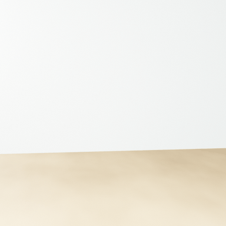
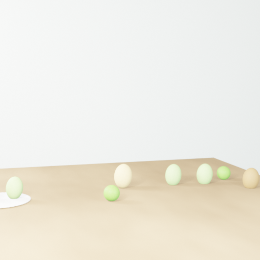
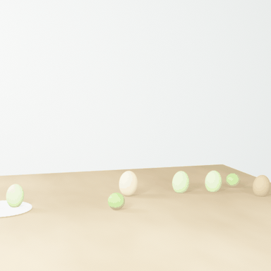
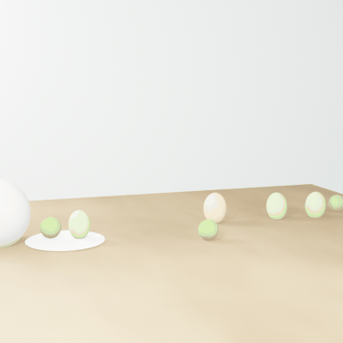
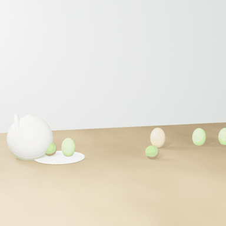
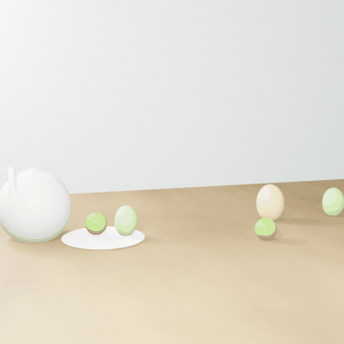
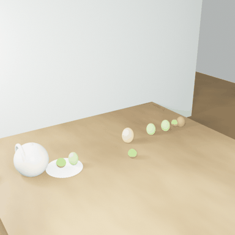
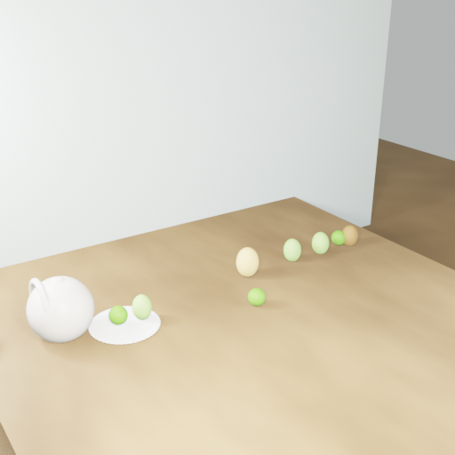
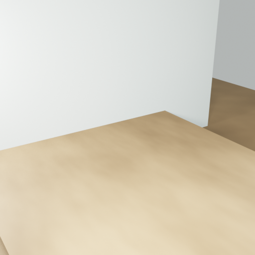

# Dynamic Scene: Artist (Cezanne Still Life) — Baseline Results

**Date:** 2026-02-06
**Task:** `artist` (dynamic_scene)
**Output:** `output/dynamic_scene/20260206_011742/artist/`
**Pipeline:** Baseline VIGA (no SAM3D, no Meshy — procedural geometry only)

---

## 1. Run Configuration

| Parameter | Value |
|-----------|-------|
| Model | GPT-5 |
| Render Engine | EEVEE (`BLENDER_EEVEE_NEXT`) |
| Prompt Setting | `none` (default) |
| Max Rounds | 100 |
| Duration | ~80 minutes |
| Generator Tools | `exec.py`, `generator_base.py`, `initialize_plan.py` |

```bash
"python" runners/dynamic_scene.py \
  --task=artist \
  --model=gpt-5 \
  --blender-command="blender"
```

**Note:** This was the first successful dynamic scene run on Windows. No asset pipeline (SAM3D or Meshy) — all objects are procedural Blender geometry generated by GPT-5.

---

## 2. Target Image & Description


**Target image:** Cezanne "Still Life with Jug" — ceramic jug, plate, green apples, and pears on a table.

**Dynamic effect:** "Throw a ball onto the table and smash all the objects on the table down."

---

## 3. Render Results

Each round's scene is visualized with two views:
- **First Frame (Frame 1)** — static render from the rotation camera at the original camera position
- **360° Rotation GIF** — camera orbits the scene center (ray-cast anchor point), rendered at frame 1

### Round 2 — Initial Scene Setup

**First Frame:**


**360° Rotation:**


**Observations:** Empty table surface (beige) with white wall backdrop. Camera and lighting established. No objects yet.

### Round 5 — First Objects Appear

**First Frame:**


**360° Rotation:**


**Observations:** GPT-5 generated procedural objects: egg-shaped spheres for apples/pears, a white sphere for the jug, a flat white disc for the plate. Objects are simple geometric primitives — no textures or realistic details.

### Round 7 — Scene Refinement

**First Frame:**


**360° Rotation:**


**Observations:** Objects repositioned and scaled. Jug (white sphere) on the left with a green sphere beside it on the plate. Multiple egg-shaped objects spread across the table surface.

### Round 9 — Ball Physics Added

**First Frame (Before Impact):**


**360° Rotation:**


**Animation Keyframes (Start → Mid → End):**

| Frame 1 | Frame 90 | Frame 180 |
|---------|----------|-----------|
|  |  |  |

**Observations:** Ball physics simulation added. Objects on the table with a ball approaching. Mid-frame shows the ball impacting. End frame shows objects displaced from their original positions.

### Round 11 — Animation Refinement

**First Frame:**


**360° Rotation:**


**Observations:** Continued iteration on physics parameters. Objects more tightly grouped on the table.

### Round 12 — Final Render

**First Frame (Before Impact):**


**360° Rotation:**


**Animation Keyframes (Start → Mid → End):**

| Frame 1 | Frame 100 | Frame 200 |
|---------|-----------|-----------|
|  |  |  |

**Observations:** **Final scene.** The ball physics successfully knocked ALL objects off the table — mid and end frames show an empty table surface. The dynamic effect ("smash all objects down") was fully achieved, though object quality is low (simple geometric primitives).

---

## 4. Generator Round Summary

**Phase 1 — Scene Setup (Rounds 0-4):**
- Round 0: `initialize_plan` — Generator receives task description and target image
- Rounds 1-2: Initial Blender scripts — table, wall, camera, lighting
- Rounds 3-4: First procedural object attempts

**Phase 2 — Object Placement (Rounds 5-8):**
- Round 5: First working composition — procedural spheres for fruit, jug, plate
- Rounds 6-8: Verifier-guided refinement of positions, colors, sizes

**Phase 3 — Dynamic Animation (Rounds 9-12):**
- Round 9: First ball physics — rigid body simulation
- Rounds 10-11: Physics parameter tuning
- Round 12: Final render — ball successfully smashes all objects off the table

---

## 5. Key Observations

1. **All objects are procedural geometry** — GPT-5 created spheres, ellipsoids, and discs as approximations of the Cezanne still life objects
2. **No texture or material detail** — objects are simple colored shapes (green spheres for apples, beige spheres for pears, white sphere for jug)
3. **Dynamic effect was more successful than SAM3D+Meshy run** — the ball knocked ALL objects off the table in the baseline run, compared to only one pear in the later run
4. **Faster execution** — ~80 minutes vs ~3h 23m for the SAM3D+Meshy run (no asset generation overhead)
5. **12 rounds vs 25 rounds** — baseline converged faster without the asset acquisition phase
6. **First successful Windows run** — required fixes to path resolution, Windows quoting, pipe deadlock, and encoding (documented in `20260206_DynamicScene_Windows_Experience.md`)

---

## 6. Baseline vs SAM3D+Meshy Comparison

| Aspect | Baseline (2026-02-06) | SAM3D+Meshy (2026-02-10) |
|--------|----------------------|--------------------------|
| Asset type | Procedural geometry (spheres) | Meshy GLB models (realistic) |
| Object quality | Low — simple shapes | High — recognizable 3D models |
| Dynamic effect | Ball smashed ALL objects off table | Ball knocked only one pear off |
| Duration | ~80 minutes | ~3h 23 minutes |
| Rounds | 12 | 25 |
| Pipeline | VIGA only | SAM3D + Meshy + VIGA |
| SAM3D | Not used | 8/8 reconstructed, all discarded |
| Meshy | Not used | 4 new assets (jug, pear, apple, plate) |

---

## 7. File Listing

```
output/dynamic_scene/20260206_011742/artist/
├── scripts/ (1-12.py — 12 Blender Python scripts)
├── renders/
│   ├── 1/ (state.blend only — render failed)
│   ├── 2/ (Camera_f0001/f0090/f0180 + state.blend)
│   ├── 3-4/ (state.blend only)
│   ├── 5-12/ (3 keyframe PNGs + state.blend each)
│   └── ...
├── gifs/ (360° rotation GIFs + frame PNGs per round)
│   ├── round_N.gif (36-frame rotation GIF, 384×384)
│   └── round_N_frames/ (36 PNG frames, 512×512)
├── investigator/ (Verifier inspection scripts + renders)
├── generator_memory.json
├── verifier_memory.json
├── RESULTS.md (auto-generated by render_rounds_gif.py)
└── blender_file.blend
```

---

*Generated by VIGA (Vision-as-Inverse-Graphics Agent) with GPT-5 Generator + Verifier*
*Analysis by Claude Opus 4.6*
