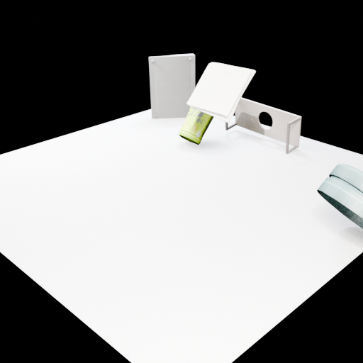
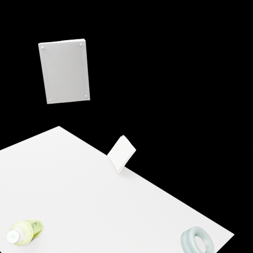
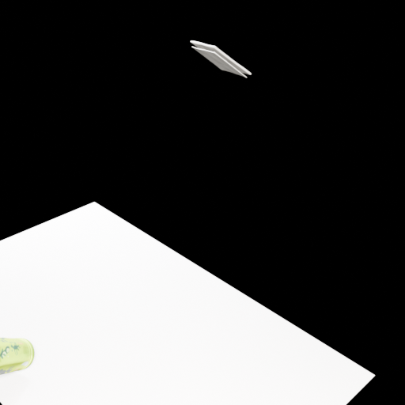
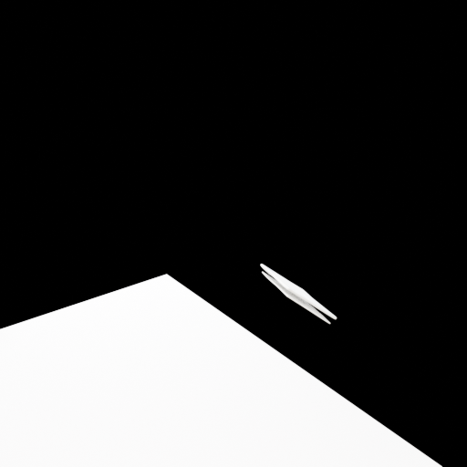
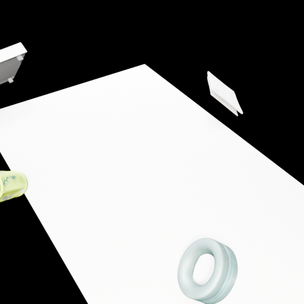
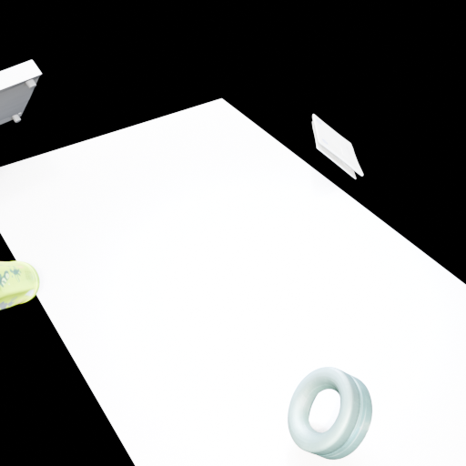
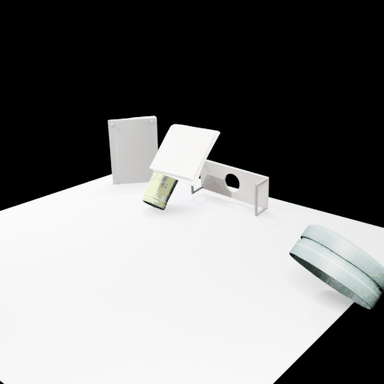
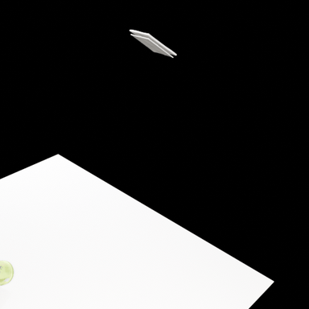
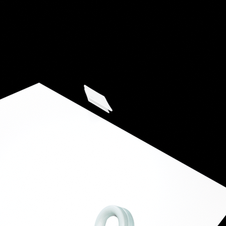

# Static Scene: Green Tea — Run 8 (Meshy API Key Configured)

**Date:** 2026-02-08
**Task:** `greentea` (static_scene)
**Output:** `output/static_scene/20260208_204903/greentea/`
**Previous Run:** Run 7 (identical prompt, no Meshy API key)

---

## 1. Run Configuration

Same command as Run 7, but with Meshy API key now configured in `utils/_api_keys.py`:

| Parameter | Value |
|-----------|-------|
| Model | GPT-5 |
| Render Engine | EEVEE (`BLENDER_EEVEE_NEXT`) |
| Prompt Setting | `get_asset_simple` |
| Max Rounds | 15 |
| Duration | ~35 minutes (2081 seconds) |
| Meshy API Key | Configured (`msy_1nQ...`) |

**Key observation:** The Meshy API was **never called**. All 5 assets matched via local fuzzy matching before the API could be invoked. The fuzzy matcher finds `table.glb`, `ito_en_bottle.glb`, etc. in `data/static_scene/greentea/assets/` and returns them immediately. To use the Meshy API for fresh 3D model generation, the existing local assets would need to be removed or renamed to prevent fuzzy matching.

---

## 2. Asset Acquisition

Identical to Run 7 — all 5 assets matched locally:

| Round | Query | Matched File | Meshy API Called? |
|-------|-------|-------------|-------------------|
| 1 | `"table"` | `table.glb` | No (local match) |
| 2 | `"ito en bottle"` | `ito_en_bottle.glb` | No (local match) |
| 3 | `"keyboard"` | `alienware_keyboard.glb` | No (local match) |
| 4 | `"headphones"` | `headphones.glb` | No (local match) |
| 5 | `"envelope"` | `envelope.glb` | No (local match) |

---

## 3. Render Results

### Round 2 — Initial Layout (All Objects Visible)


**Observations:** Best early render. All 5 objects clearly visible on white ground plane with dark background. ITO EN bottle (green, tilted), table bracket (behind), keyboard panel (standing), envelope (white rectangle), headphones (teal ring, foreground). Objects arranged as a loose desktop still life.

### Round 4 — Overhead Angle


**Observations:** Overhead perspective. Keyboard panel floating above ground plane. ITO EN bottle and headphones ring visible at bottom. Objects scattered — some cut off at frame edges.

### Round 5 — Top-Down Close


**Observations:** Similar to Round 4 but closer. Envelope (top-right), bottle (center), keyboard (small, top-center). Large white ground plane.

### Round 6 — Lost Objects


**Observations:** Regression — camera moved to extreme angle. Only ground plane edge and a tiny white object visible. Most objects lost from frame. The Verifier failed to catch this.

### Round 8 — Recovery


**Observations:** Partial recovery. Table bracket visible (top-left corner), ITO EN bottle (left edge), envelope (top-center), headphones ring (bottom-center). Objects spread along ground plane edges. Perspective view.

### Round 9 — Final Scene


**Observations:** Final composition. Objects arranged on ground plane with 50mm camera lens. ITO EN bottle (left, tilted), table bracket (top-left, partially visible), envelope (top-center), headphones ring (bottom-center). More scattered than Run 7's final scene. The 50mm lens provides tighter framing but objects are at the periphery.

---

## 4. 360° Rotation GIFs

| Round | GIF |
|-------|-----|
| Round 2 |  |
| Round 5 |  |
| Round 9 (Final) |  |

---

## 5. Comparison: Run 7 vs Run 8

| Aspect | Run 7 | Run 8 |
|--------|-------|-------|
| Meshy API Key | Not configured | Configured (not used) |
| Duration | 42 min (2508s) | 35 min (2081s) |
| Scripts | 9 | 9 |
| Renders | 8 | 7 |
| Asset source | Local fuzzy match | Local fuzzy match (identical) |
| Best early render | Round 4 (top-down, all visible) | Round 2 (perspective, all visible) |
| Worst render | — (consistent improvement) | Round 6 (lost all objects) |
| Final scene quality | **Better** — table used as desk, objects ON table | Worse — objects scattered on ground plane |
| Camera approach | 32mm wide → tabletop close-up | Multiple angles, settled on 50mm |
| Table usage | Scaled to 1.6, used as furniture | Not used as furniture |

### Analysis

1. **Meshy API was not invoked** because the local fuzzy matcher intercepts all queries before the API is reached. The asset acquisition pipeline is: (a) check local `previous_assets_dir` for fuzzy name match → (b) if no match, call Meshy API. Since our SAM3D GLBs are already in the assets directory with matching names, step (a) always succeeds.

2. **Run 8 had slightly worse scene composition** than Run 7. The Verifier missed a critical failure in Round 6 where all objects were lost from the camera view. While it recovered by Round 8-9, the final composition is more scattered than Run 7's coherent tabletop arrangement.

3. **GPT-5 scene composition is non-deterministic.** The same prompt, same assets, and same pipeline produce different scene arrangements between runs. Run 7 found an elegant solution (scaling the table bracket to desk size, placing objects on top), while Run 8 kept objects scattered on a flat ground plane.

4. **To actually test Meshy API generation**, the next step would be to:
   - Move existing SAM3D assets to a backup folder
   - Run the pipeline so that fuzzy matching fails
   - Let Meshy's text-to-3D generate new, potentially higher-quality models
   - Compare Meshy-generated assets with SAM3D reconstructions

---

## 6. File Listing

```
output/static_scene/20260208_204903/greentea/    # Run 8
├── scripts/ (1-9.py)
├── renders/ (2-6, 8-9)
└── rotation_gif/ (round_2, round_5, round_9 GIFs)
```

---

*Generated by VIGA (Vision-as-Inverse-Graphics Agent) with GPT-5 Generator + Verifier*
*Analysis by Claude Opus 4.6*
