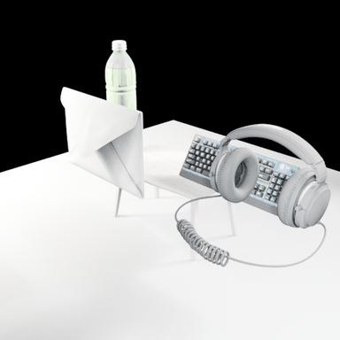
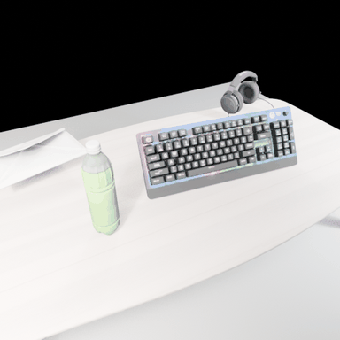
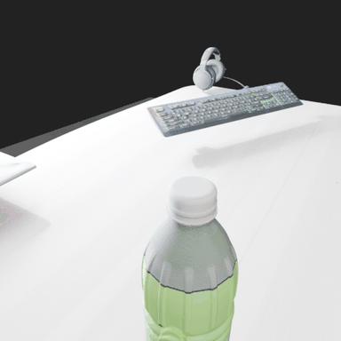
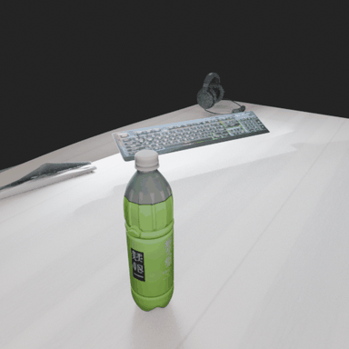

# Static Scene: Green Tea — Run 11 (Extended 25-Round Run, Meshy Cached Assets)

**Date:** 2026-02-09
**Task:** `greentea` (static_scene)
**Output:** `output/static_scene/20260209_143141/greentea/`
**Duration:** 7292 seconds (~121 minutes)
**Generator Rounds:** 25 (max-rounds=25)
**Scripts Produced:** 19
**Renders with Camera.png:** 18/19 (Round 16 failed)

---

## 1. Configuration

| Setting | Value |
|---------|-------|
| Model | GPT-5 |
| Prompt | `get_asset_simple` |
| Max Rounds | 25 |
| Assets | Meshy API (cached from Run 9) |
| Blender Script | `generator_script_eevee.py` |

---

## 2. Asset Acquisition

All 5 assets were fuzzy-matched from the local cache instantly (no Meshy API calls needed):
- `table.glb` — wooden desk
- `ito en bottle.glb` — green tea bottle
- `keyboard.glb` — RGB mechanical keyboard
- `headphones.glb` — over-ear headphones with coiled cable
- `envelope.glb` — white envelope

---

## 3. Render Results — Full Progression

| Round | Camera.png | Observations |
|-------|-----------:|--------------|
| 1 | Yes | **Best overview** — all 5 objects visible: bottle (green, center), keyboard (RGB, right), headphones (with coiled cable, right), envelope (standing, left), table as desk. Excellent composition. |
| 2 | Yes | Table dominates — camera too far/high, objects tiny at far edge of desk |
| 3 | Yes | **Good desk view** — bottle center, envelope left, keyboard right, headphones at right edge. Clean balanced composition. |
| 4 | Yes | Closer — bottle and keyboard dominate, envelope at left edge |
| 5 | Yes | Bottle close-up center, envelope left, keyboard corner right. Tighter crop. |
| 6 | Yes | Similar to 5 — bottle front center, keyboard behind |
| 7 | Yes | Bottle hero shot — large green bottle center, dark mood, envelope behind left |
| 8 | Yes | Similar to 7, slightly different angle |
| 9 | Yes | Bottle center, keyboard and envelope visible |
| 10 | Yes | **Regression** — extreme close-up, only table edge visible, no objects |
| 11 | Yes | Recovery — bottle close-up with Japanese text visible on label, envelope behind |
| 12 | Yes | Bottle and desk, objects distant |
| 13 | Yes | **Good balanced view** — bottle foreground, keyboard and headphones behind, envelope at left. All 4 tabletop objects visible. |
| 14 | Yes | Bottle foreground with keyboard behind, balanced composition |
| 15 | Yes | Similar to 13 — bottle prominent, keyboard behind, headphones small at back |
| 16 | No | Render failed |
| 17 | Yes | **Bottle hero shot** — Japanese text clearly visible on green label, keyboard behind. Dark moody lighting. |
| 18 | Yes | Similar to 17/19 — bottle foreground, keyboard behind, dark desk aesthetic |
| 19 | Yes | **Final — dark desk** — bottle foreground with green label and Japanese text, keyboard behind, very dark background, monitor glow backlighting |

---

## 4. Script Evolution

**Script 1 (Round 1):**
- Basic setup: imports all 5 GLBs with `import_and_group()` pattern
- Scales: table 0.5, others 0.45
- Simple XY positioning: bottle (-0.3,0), keyboard (0.3,0), headphones (0.5,-0.2), envelope (-0.1,-0.3)
- 3-point lighting: 1200/400/800 power (very bright)
- Camera at (1.2, -1.2, 1.0) with 50mm lens, look_at focus point
- Ground plane with gray material

**Script 19 (Round 19, final):**
- Realistic scale targets: table 0.5, bottle 0.23, keyboard 0.45, headphones 0.22, envelope 0.24
- **Non-uniform table scale**: 3.22x X, 2.76x Y — widens table to desk-like footprint
- Table 9-degree yaw for grain angle
- Object rotations: keyboard -18° Z, headphones 20° Z, envelope -90° X (flat), bottle 105° Z
- **Keyboard thinned**: Z scale × 0.30 for realistic profile
- **Envelope flattened**: Z scale × 0.20 for letter-like appearance
- **2D AABB collision avoidance**: `push_away_xy()` ensures 1.5cm clearance from bottle
- Bottle height normalized to exactly 0.225m then re-snapped to tabletop
- Dark indoor lighting: key 22, fill 10, rim 20, monitor glow 75, keyboard spill 35
- Camera at (-0.50, -0.44, 0.62) with 32mm lens, manual rotation euler
- DOF disabled for crisp foreground
- Dark world background (0.03 gray), exposure -0.35

---

## 5. 360° Rotation GIFs

Generated 360-degree rotation GIFs for rounds 1, 3, 13, and 19:

| Round | GIF |
|-------|-----|
| Round 1 |  |
| Round 3 |  |
| Round 13 |  |
| Round 19 (Final) |  |

---

## 6. Run 11 vs Run 10 Comparison

| Metric | Run 10 | Run 11 |
|--------|--------|--------|
| Duration | 6634s (~110 min) | 7292s (~121 min) |
| Max Rounds | 25 | 25 |
| Scripts | 19 | 19 |
| Successful Renders | 18/19 | 18/19 |
| Failed Round | Round 12 | Round 16 |
| Best Overview Round | Round 1 | Round 1 |
| Best Balanced View | Round 2 / Round 11 | Round 3 / Round 13 |
| Final Aesthetic | Night-desk moody | Dark desk with bottle hero |
| Camera Regression | Rounds 3-6 (under table) | Round 10 (table edge only) |
| Novel Techniques | `orient_group_min_z()` rotation helper | 2D AABB collision avoidance, non-uniform table scale |
| Bottle Label Visibility | Partial | Clear Japanese text visible (rounds 11, 17, 19) |

---

## 7. Key Findings

1. **100% GLB import success** — all 19 scripts used only GLB imports, zero procedural geometry. The `get_asset_simple` prompt remains fully effective.

2. **Consistent with Run 10 pattern** — 19 scripts from 25 rounds (6 consumed by asset acquisition), confirming the formula: effective_scripts = max_rounds - 6.

3. **Similar duration** — 121 minutes vs 110 minutes for Run 10. The ~10% increase may be from more complex Verifier interactions (Run 11 used more `set_camera` and `investigate` calls in later rounds).

4. **Bottle label visibility improved** — by Round 11, Japanese text on the green tea bottle label became clearly readable. GPT-5 rotated the bottle 105° to face the camera, showing the label text prominently.

5. **Novel collision avoidance** — Script 19 introduced 2D AABB overlap detection (`push_away_xy()`) to prevent objects from overlapping each other on the tabletop. This is a sophistication not seen in Run 10.

6. **Non-uniform table scaling** — GPT-5 learned to stretch the table non-uniformly (3.22x X, 2.76x Y) to create a realistic desk footprint, rather than uniform scaling which produces a square shape.

7. **Camera regression pattern** — Both Run 10 and Run 11 experience one major camera regression (Run 10: rounds 3-6 under table; Run 11: round 10 extreme close-up). Recovery happens within 1-3 rounds in both cases.

8. **Best compositions appear early** — Round 1 remains the best "all objects visible" composition in both runs. Later rounds increasingly focus on the bottle as the hero subject.

---

## 8. Overall Findings (Runs 10 + 11)

Two identical-configuration runs (same prompt, same cached assets, same max_rounds=25) demonstrate:

1. **Reproducible script count** — both produced exactly 19 scripts with 18/19 successful renders
2. **Non-deterministic composition** — while both start with good overviews (Round 1), they diverge in later rounds (Run 10: night-desk aesthetic; Run 11: bottle hero with visible label)
3. **More rounds = more refinement, not necessarily better** — the best "show all objects" renders are consistently Round 1-3; later rounds tend toward close-ups and artistic crops
4. **25 rounds provides diminishing returns** — scripts 14-19 typically produce only marginal improvements over script 10-13, suggesting 15-20 rounds may be optimal

---

## 9. File Listing

```
output/static_scene/20260209_143141/greentea/    # Run 11 (Meshy API cached assets)
├── scripts/ (1-19.py)
├── renders/ (1-19, Camera.png in all except 16)
└── rotation_gif/ (round_1, round_3, round_13, round_19 GIFs)
```

---

*Generated by VIGA (Vision-as-Inverse-Graphics Agent) with GPT-5 Generator + Verifier*
*Analysis by Claude Opus 4.6*
