# Dynamic Scene: Artist (Cezanne Still Life) — Run 1 Results

**Date:** 2026-02-10
**Task:** `artist` (dynamic_scene)
**Output:** `output/dynamic_scene/20260210_194152/artist/`
**Pipeline:** Combined SAM3D + Meshy (`get_asset_sam3d`)

---

## 1. Run Configuration

| Parameter | Value |
|-----------|-------|
| Model | GPT-5 |
| Render Engine | EEVEE (`BLENDER_EEVEE_NEXT`) |
| Prompt Setting | `get_asset_sam3d` |
| Max Rounds | 25 |
| Duration | ~3 hours 23 minutes (12191 seconds) |
| Generator Tools | `exec.py`, `generator_base.py`, `meshy.py`, `sam3d/init.py`, `initialize_plan.py` |

```bash
python runners/dynamic_scene.py \
  --task=artist \
  --model=gpt-5 \
  --blender-command=blender \
  --blender-script="data/dynamic_scene/generator_script.py" \
  --prompt-setting=get_asset_sam3d \
  --generator-tools="tools/blender/exec.py,tools/generator_base.py,tools/assets/meshy.py,tools/sam3d/init.py,tools/initialize_plan.py" \
  --max-rounds=25
```

---

## 2. Target Image & Description


**Target image:** Cezanne "Still Life with Jug" — ceramic jug, plate, green apples, and pears on a table.

**Dynamic effect:** "Throw a ball onto the table and smash all the objects on the table down."

---

## 3. Timeline

| Time | Event |
|------|-------|
| 19:41 | Pipeline starts, agents initialized |
| 19:41 | SAM segmentation begins (sam env) |
| 19:42 | SAM detects 8 objects, starts SAM3D reconstruction (sam3d_py311 env) |
| 19:42-20:42 | SAM3D reconstructs 8 objects sequentially (~8-12 min each) |
| 20:42 | SAM3D: 6/8 done; Generator starts Phase 1 (first GPT-5 call) |
| 20:43-20:44 | Rounds 0-2 — initialize_plan + first Blender scripts |
| 20:44-20:46 | Rounds 3-4 — Generator calls get_better_object (jug via Meshy API) |
| 20:46-21:10 | Meshy generates jug.glb (preview 019c4b05, refine, download) |
| 21:10-21:38 | Round 5 — get_better_object (pear via Meshy API, first attempt) |
| 21:17 | SAM3D: all 8/8 objects reconstructed + imported to Blender |
| 21:38-21:55 | Round 6 — get_better_object (pear, second Meshy gen) |
| 21:55-22:00 | Round 7 — get_better_object (apple via Meshy API) |
| 22:00-22:06 | Round 8 — get_better_object (plate via Meshy API) |
| 22:06-22:20 | Rounds 9-10 — Phase 2 scene composition with Meshy assets |
| 22:20-22:42 | Rounds 11-14 — Scene refinement + Verifier feedback cycles |
| 22:42-23:05 | Rounds 15-24 — Dynamic animation (ball physics) iterations |
| 23:05 | **Pipeline completed** — 25 rounds, 12191 seconds total |

---

## 4. SAM3D Reconstruction Results (8/8 success)

| Object | Status | GLB Path |
|--------|--------|----------|
| ceramic_jug | SUCCESS | `sam_init/ceramic_jug.glb` |
| green_pears | SUCCESS | `sam_init/green_pears.glb` |
| orange_pears | SUCCESS | `sam_init/orange_pears.glb` |
| plate_with_fruits | SUCCESS | `sam_init/plate_with_fruits.glb` |
| orange_pear | SUCCESS | `sam_init/orange_pear.glb` |
| green_apple | SUCCESS | `sam_init/green_apple.glb` |
| green_pear | SUCCESS | `sam_init/green_pear.glb` |
| green_apple_1 | SUCCESS | `sam_init/green_apple_1.glb` |

### SAM Segmentation Crops

SAM segmented 8 objects from the Cezanne painting. These masked crops were fed into SAM3D for 3D reconstruction:

| ceramic_jug | green_pears | orange_pears | plate_with_fruits |
|-------------|-------------|--------------|-------------------|
| 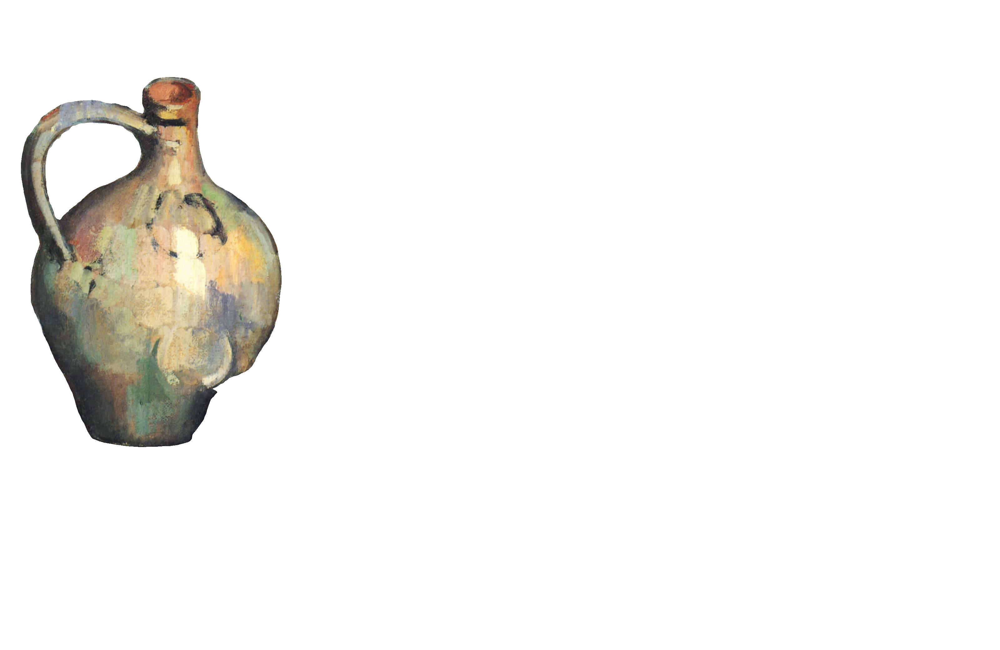 | 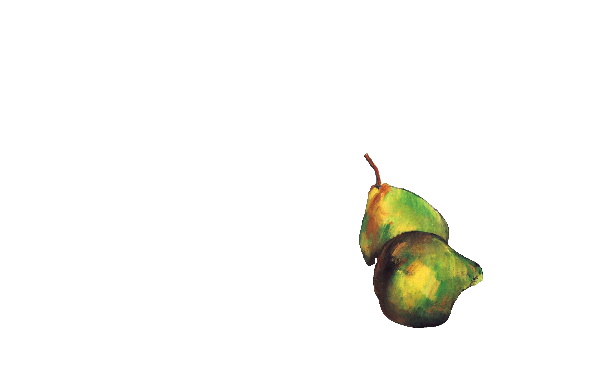 | 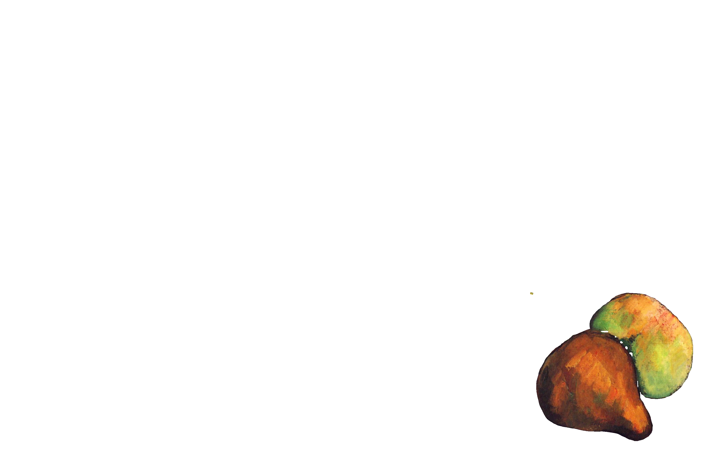 | 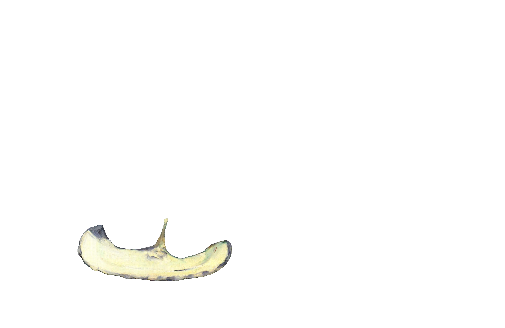 |

| orange_pear | green_apple | green_pear | green_apple_1 |
|-------------|-------------|------------|---------------|
| 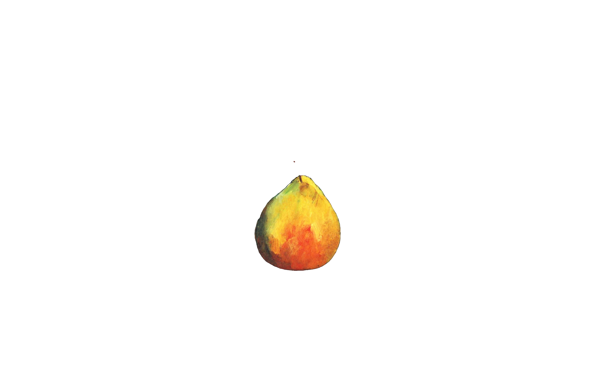 | 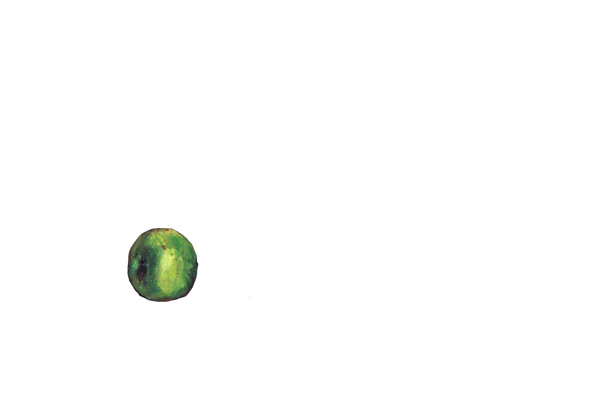 | 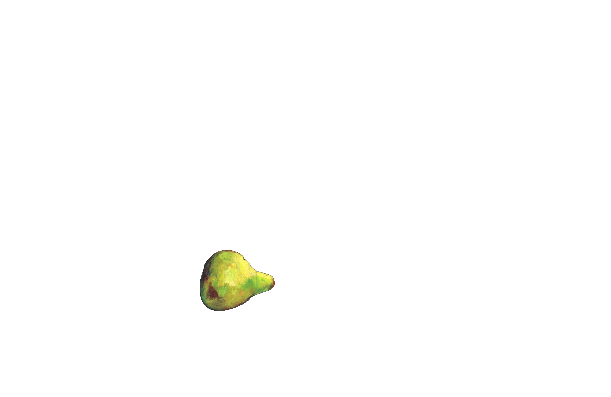 | 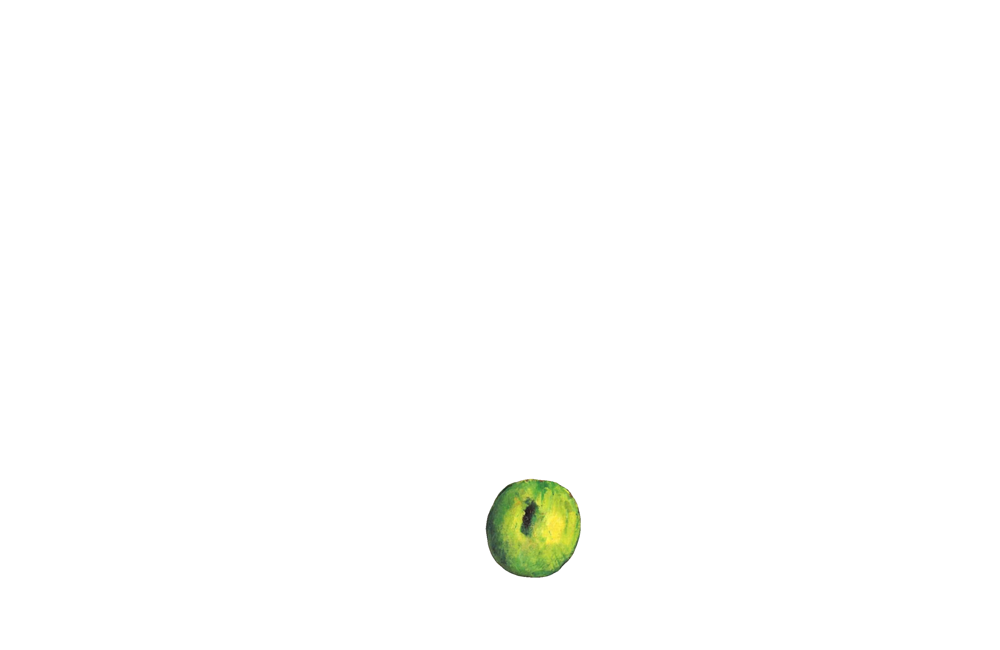 |

### SAM3D 3D Reconstructions (Rendered GLBs)

Each SAM3D GLB file rendered as a 360° rotation GIF in Blender (36 frames, 384x384):

| ceramic_jug | green_pears | orange_pears | plate_with_fruits |
|-------------|-------------|--------------|-------------------|
| 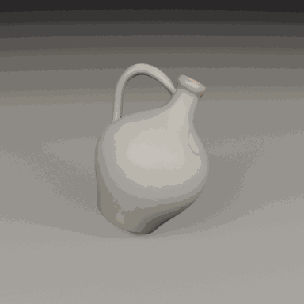 |  | 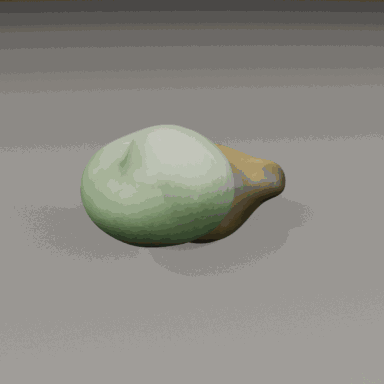 | 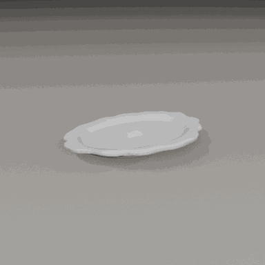 |

| orange_pear | green_apple | green_pear | green_apple_1 |
|-------------|-------------|------------|---------------|
| 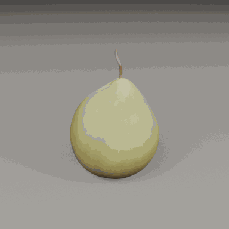 | 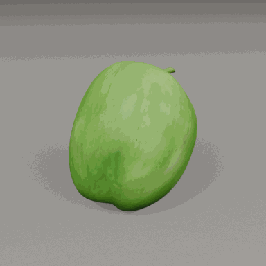 | 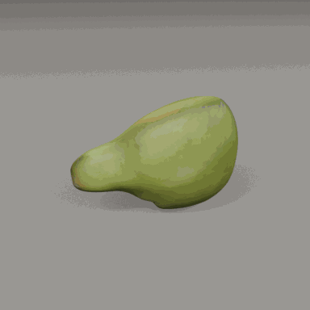 | 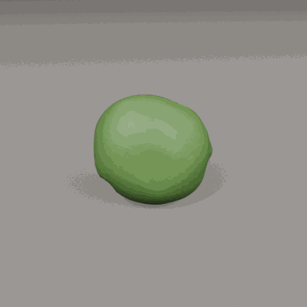 |

**Observations:**
- **ceramic_jug** — Best reconstruction: recognizable jug shape with handle, smooth surface
- **green_apple** — Good: round apple shape with green color preserved
- **orange_pear / green_pears** — Reasonable: pear-like shapes with stems visible
- **plate_with_fruits** — Flat disc shape, reasonable plate reconstruction
- **orange_pears / green_pear / green_apple_1** — Lower quality: blobby shapes, less recognizable

**Note:** All 8 SAM3D reconstructions were ultimately discarded by the Generator in favor of Meshy-generated replacements — SAM3D is designed for real photos, not paintings. The painted brushstroke textures produced low-quality 3D meshes.

---

## 5. Meshy Replacements

The Generator replaced all SAM3D objects with Meshy-generated versions (4 new API-generated assets):

| Object | Preview ID | Refine ID | File |
|--------|------------|-----------|------|
| Stoneware jug | 019c4b05 | 019c4b06 | `assets/jug.glb` |
| Bartlett pear (attempt 1) | 019c4b1b | 019c4b1d | — (superseded) |
| Bartlett pear (attempt 2) | 019c4b35 | 019c4b3b | `assets/pear.glb` |
| Granny Smith apple | 019c4b44 | 019c4b46 | `assets/apple.glb` |
| White ceramic plate | 019c4b49 | 019c4b4a | `assets/plate.glb` |

**Note:** No cached Meshy assets existed for this task (first run). All 4 assets were generated via Meshy API from scratch.

---

## 6. Render Results

Each round's scene is visualized with two views:
- **First Frame (Frame 1)** — static render from the original camera, showing the scene before any animation
- **360° Rotation GIF** — camera orbits the scene center (ray-cast anchor point), rendered at frame 1

### Round 2 — Initial Scene Setup

**First Frame:**
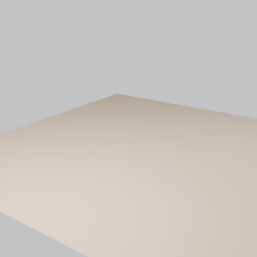

**360° Rotation:**


**Observations:** Empty table surface with gray background. Basic scene geometry only — no objects imported yet.

### Round 9 — First Meshy Asset Composition

**First Frame:**
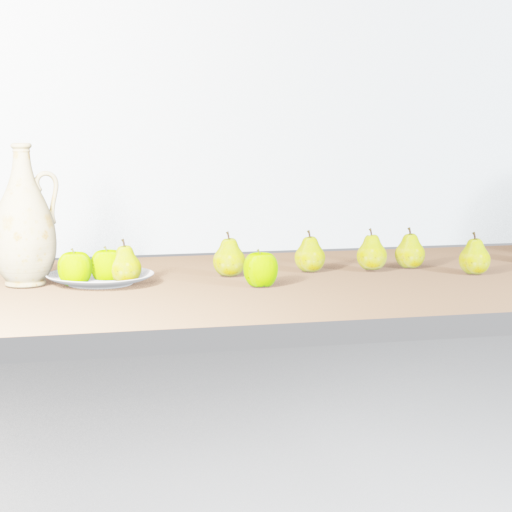

**360° Rotation:**
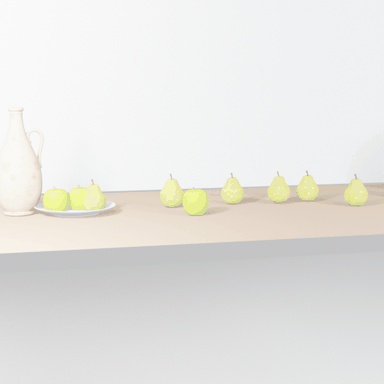

**Observations:** First composition with Meshy assets. Jug (white ceramic), plate with apples, pears spread across the table. Objects properly placed on the table surface. Scene matches the Cezanne still life layout.

### Round 14 — Verifier-Refined Composition

**First Frame:**


**360° Rotation:**
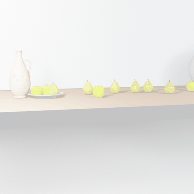

**Observations:** Verifier-guided refinement. Objects repositioned based on feedback. Layout closer to target image arrangement.

### Round 16 — Ball Physics Added

**First Frame (Before Impact):**
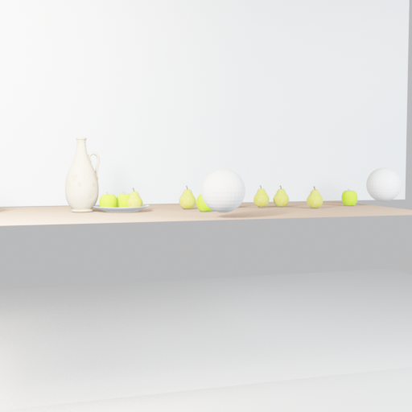

**360° Rotation:**
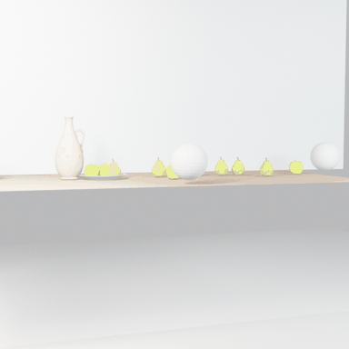

**Animation Keyframes (Start → Mid → End):**

| Frame 1 | Frame 160 | Frame 320 |
|---------|-----------|-----------|
|  | 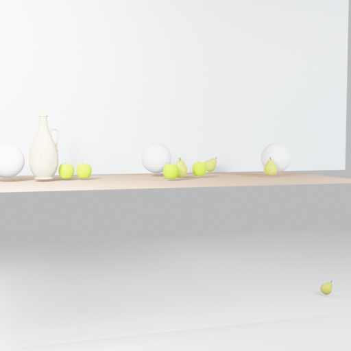 | 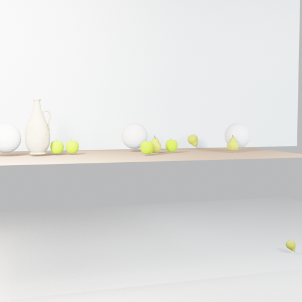 |

**Observations:** Ball has rolled through the scene. One pear knocked off the table edge. Most objects shifted but stayed on surface.

### Round 18 — Final Render

**First Frame (Before Impact):**


**360° Rotation:**
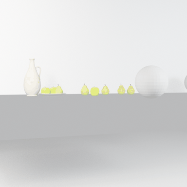

**Animation Keyframes (Start → Mid → End):**

| Frame 1 | Frame 260 | Frame 520 |
|---------|-----------|-----------|
| 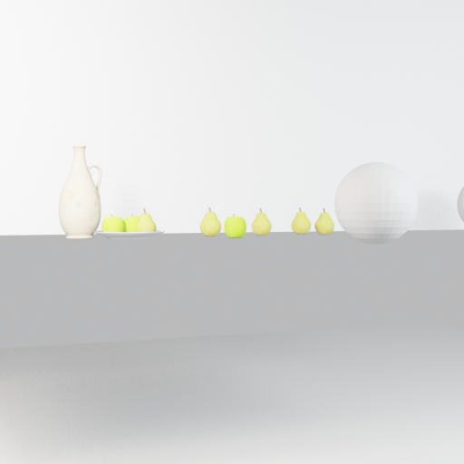 | 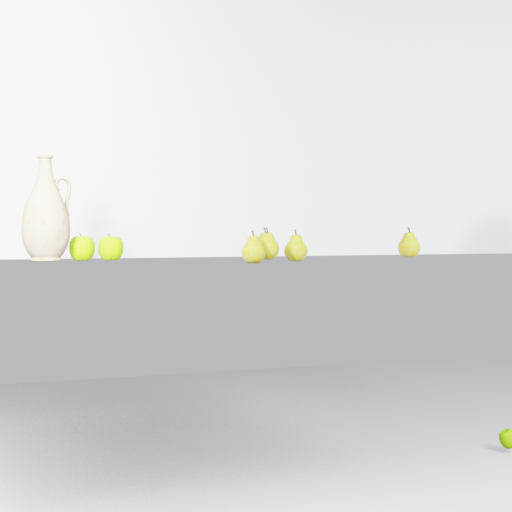 |  |

**Observations:** **Final scene composition.** Jug, apples, pears on table. Ball knocked one pear off (visible bottom-right in end frame). Most objects remain on table — ball didn't have enough force to smash everything off.

---

## 7. Generator Round Summary

**Phase 0 — Init (Rounds 0-2):**
- Round 0: `initialize_plan` — Generator receives task description, target image, and dynamic description
- Rounds 1-2: `execute_and_evaluate` — Initial Blender scripts (table + camera setup)
- Verifier feedback cycle on round 2

**Phase 1 — Meshy Replacements (Rounds 3-8):**
- Round 3: `get_better_object` — jug (NEW via Meshy API)
- Round 4: `get_better_object` — pear attempt 1 (error: `list index out of range`)
- Rounds 5-6: `get_better_object` — pear attempt 2 (NEW via Meshy API)
- Round 7: `get_better_object` — apple (NEW via Meshy API)
- Round 8: `get_better_object` — plate (NEW via Meshy API)

**Phase 2 — Scene Composition (Rounds 9-14):**
- Round 9: `execute_and_evaluate` — First Meshy-asset composition + Verifier (3 rounds)
- Rounds 10-13: `execute_and_evaluate` — Scene layout refinement
- Round 14: `execute_and_evaluate` + Verifier — Object positioning adjustments

**Phase 3 — Dynamic Animation (Rounds 15-24):**
- Rounds 15-16: `execute_and_evaluate` + Verifier — Add ball physics, rigid body simulation
- Verifier on round 15 used `set_keyframe` tool (2 calls) to examine animation frames
- Rounds 17-24: `execute_and_evaluate` — Iterate on ball trajectory, physics settings, frame range
- Multiple Verifier cycles examining the animation quality

---

## 8. Renders Produced

| Round | Frames | Notes |
|-------|--------|-------|
| 1 | state.blend only | Initial setup |
| 2 | f0001, f0125, f0250 | Empty table surface |
| 3 | state.blend only | Script iteration |
| 4 | f0001, f0125, f0250 | Early composition |
| 5-6 | state.blend only | Meshy asset requests |
| 7 | f0001, f0125, f0250 | SAM3D object evaluation |
| 8 | f0001, f0125, f0250 | Pre-Meshy composition |
| 9 | f0001, f0090, f0180 | **First Meshy scene** — all assets on table |
| 10 | f0001, f0090, f0180 | Layout adjustment |
| 11 | f0001, f0125, f0250 | Refinement |
| 12-13 | state.blend only | Script iterations |
| 14 | f0001, f0130, f0260 | Verifier-guided refinement |
| 15 | f0001, f0150, f0300 | First ball physics attempt |
| 16 | f0001, f0160, f0320 | Ball knocks pear off table |
| 17 | f0001, f0210, f0420 | Extended frame range |
| 18 | f0001, f0260, f0520 | **Final render** — best animation |
| 19 | state.blend only | Final script (no render) |

---

## 9. Key Observations

1. **SAM3D reconstructed all 8 objects** — perfect success rate on the Cezanne painting
2. **SAM3D result injection failed** — root cause identified: `ExternalToolClient.call_tool()` (`tool_client.py:164`) returns the unwrapped inner dict `{"text": [...], "data": {...}}`, but `generator.py:81` checks `result.get("status") == "success"` expecting the outer dict `{"status": "success", "output": {...}}`. The condition always evaluates to `None`, so SAM3D GLB paths and transforms are **never injected into the Generator's memory**. Additionally, even if injection succeeded, only GLB paths were passed — the transform data (translation, rotation, scale from `object_transforms.json`) was not included, so the Generator would have no pose information.
3. **Generator replaced ALL objects with Meshy** — because the Generator never received SAM3D paths (due to bug #2), it had no GLBs to import and went straight to Meshy for all objects
4. **All 4 Meshy assets were NEW** — no cached assets existed, so all were generated via the API (jug, pear, apple, plate)
5. **Dynamic animation worked** — the ball physics simulation successfully knocked objects (a pear fell off the table edge)
6. **Physics were subtle** — the ball didn't have enough velocity/mass to smash ALL objects off the table as described. Most objects shifted but stayed on the surface
7. **Frame range evolved** — the Generator progressively extended the animation frame range (250 → 180 → 260 → 300 → 320 → 420 → 520) to capture more of the physics simulation
8. **Verifier used `set_keyframe`** — in round 15, the Verifier specifically examined animation keyframes, which is dynamic-scene-specific behavior
9. **Total execution time**: 12191 seconds (~3h 23min), longer than static scene due to 8 SAM3D objects + 4 Meshy API generations
10. **Round 4 error**: `Error adding downloaded assets: list index out of range` — same bug as static scene, non-fatal

---

## 10. Final Scene vs Target

| Aspect | Target (Cezanne) | Final Render (Round 18) |
|--------|-------------------|------------------------|
| Jug | Ceramic stoneware jug with handle | Present (Meshy GLB), recognizable ceramic jug shape |
| Pears | Multiple green/yellow pears | Present (Meshy GLB), green-yellow pears on table |
| Apples | Green apples on plate | Present (Meshy GLB), green apples visible |
| Plate | White plate with fruits | Present (Meshy GLB), plate under apples |
| Table | Brown wooden table surface | Beige/tan table surface (reasonable match) |
| Background | Blue-gray painted wall | Light gray background |
| Dynamic effect | Ball smashes all objects off table | Ball knocks one pear off; most objects stay on table |

---

## 11. Known Issues

1. **SAM3D result injection bug** (FIXED): `generator.py:81` checked `result.get("status")` but `tool_client.py:164` already unwraps to inner dict — status key doesn't exist. Fix: check `result.get("data")` instead. Also: transform data (position/rotation/scale) was not passed to Generator memory — now included.
2. **Round 4 error**: `list index out of range` when adding downloaded assets (same bug as static scene run)
3. **Painting vs photo**: SAM3D is designed for real photos, not paintings — reconstruction quality is lower for artistic/painted images
4. **Physics too subtle**: The ball didn't smash ALL objects off the table as described — only one pear fell. Physics parameters (ball mass, velocity, object friction) need tuning
5. **No SAM3D objects used**: All 8 SAM3D reconstructions were discarded in favor of Meshy — the Generator never had SAM3D paths due to injection bug, so it couldn't evaluate or use them
6. **SAM3D produces pose data**: `object_transforms.json` contains translation (xyz), rotation (quaternion), and uniform scale for each object — this could enable automatic scene layout from the target image

---

## 12. File Listing

```
output/dynamic_scene/20260210_194152/artist/
├── scripts/ (1-19.py — 19 Blender Python scripts)
├── renders/
│   ├── 1/ (state.blend only)
│   ├── 2/ (Camera_f0001/f0125/f0250 + state.blend)
│   ├── 3/ (state.blend only)
│   ├── 4/ (Camera_f0001/f0125/f0250 + state.blend)
│   ├── 5-6/ (state.blend only)
│   ├── 7-11/ (3 keyframe PNGs + state.blend each)
│   ├── 12-13/ (state.blend only)
│   ├── 14-18/ (3 keyframe PNGs + state.blend each)
│   └── 19/ (state.blend only)
├── gifs/ (360° rotation GIFs + frame PNGs per round)
│   ├── round_N.gif (36-frame rotation GIF, 384×384)
│   └── round_N_frames/ (36 PNG frames, 512×512)
├── sam_init/ (8 GLB files + masks + logs)
├── RESULTS.md (auto-generated by render_rounds_gif.py)
└── blender_file.blend

data/dynamic_scene/artist/assets/
├── jug.glb (Meshy API — NEW)
├── pear.glb (Meshy API — NEW)
├── apple.glb (Meshy API — NEW)
├── plate.glb (Meshy API — NEW)
└── meshy.log
```

---

*Generated by VIGA (Vision-as-Inverse-Graphics Agent) with GPT-5 Generator + Verifier*
*Analysis by Claude Opus 4.6*
