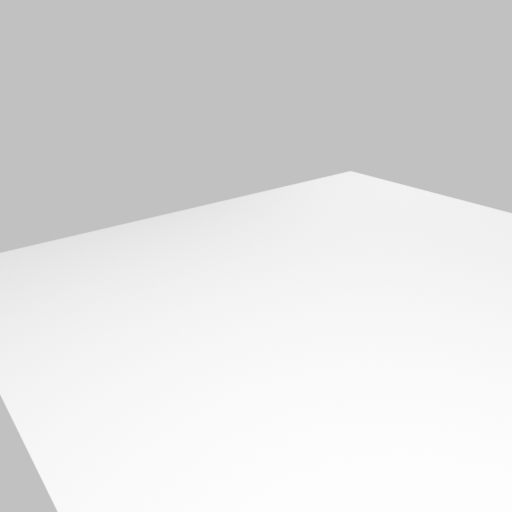
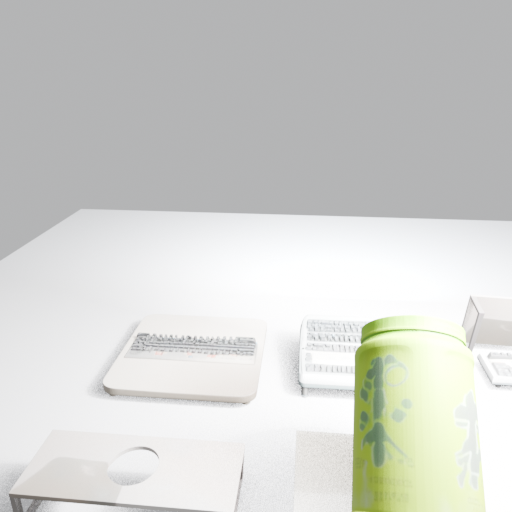
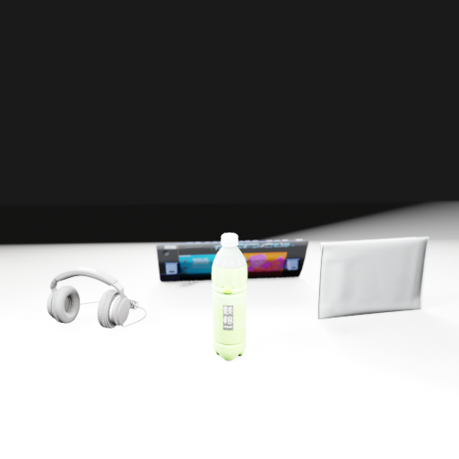
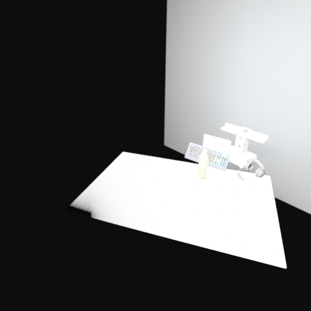
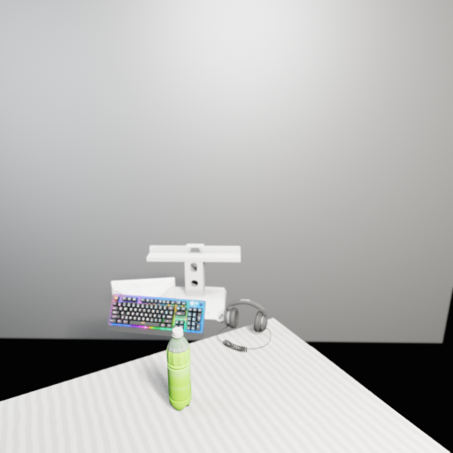
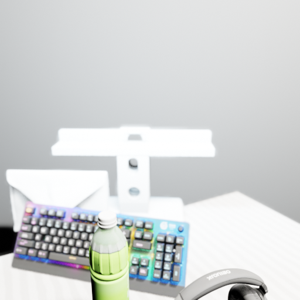
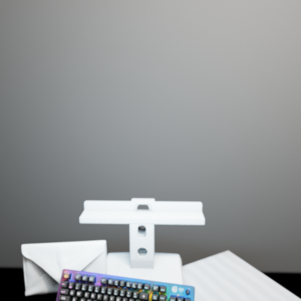
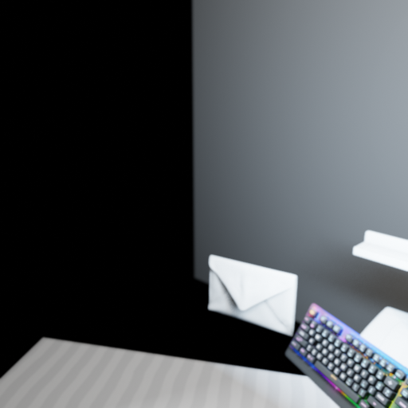
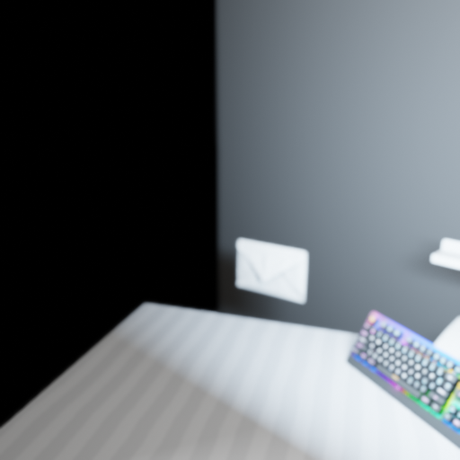
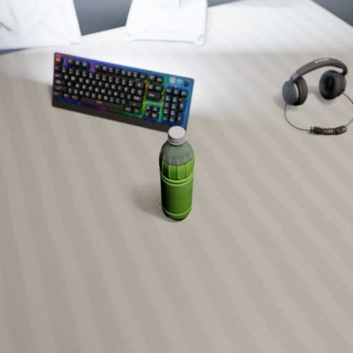

# SAM3D + Meshy Combined Pipeline — Run 1 Results

**Date:** 2026-02-10
**Task:** `greentea` (static_scene)
**Output:** `output/static_scene/20260210_043534/greentea/`
**Pipeline:** Combined SAM3D + Meshy (`get_asset_sam3d`)

---

## 1. Run Configuration

| Parameter | Value |
|-----------|-------|
| Model | GPT-5 |
| Render Engine | EEVEE (`BLENDER_EEVEE_NEXT`) |
| Prompt Setting | `get_asset_sam3d` |
| Max Rounds | 25 |
| Duration | ~2 hours 14 minutes (8042 seconds) |
| Generator Tools | `exec.py`, `generator_base.py`, `meshy.py`, `sam3d/init.py`, `initialize_plan.py` |

```bash
"C:/Users/kingy/miniconda3/envs/agent/python.exe" runners/static_scene.py \
  --task=greentea \
  --model=gpt-5 \
  --blender-command="C:/Program Files/Blender Foundation/Blender 4.5/blender.exe" \
  --blender-script="data/static_scene/generator_script_eevee.py" \
  --prompt-setting=get_asset_sam3d \
  --generator-tools="tools/blender/exec.py,tools/generator_base.py,tools/assets/meshy.py,tools/sam3d/init.py,tools/initialize_plan.py" \
  --max-rounds=25
```

---

## 2. Target Image


Ito En green tea bottle on an Alienware desk with keyboard, headphones, and envelope.

---

## 3. Timeline

| Time | Event |
|------|-------|
| 04:35 | Pipeline starts, agents initialized |
| 04:35 | SAM segmentation begins (sam env) |
| 04:36 | SAM detects 6 objects, starts SAM3D reconstruction (sam3d_py311 env) |
| ~04:36-05:36 | SAM3D reconstructs all 6 objects sequentially (~10 min each) |
| 05:36 | All 6 SAM3D objects reconstructed successfully |
| 05:36 | Generator Phase 1 begins — first GPT-5 call |
| 05:38 | Blender round 1 — initial scene render |
| 05:39-05:47 | Rounds 2-5 — Generator evaluates scene, writes scripts |
| 05:48 | SAM3D Step 3 — auto-imports 6 objects into Blender |
| 05:51-05:55 | Round 6 — Blender scene + first Verifier cycle |
| 05:55 | Meshy fuzzy-matched 4 cached assets (bottle, keyboard, headphones, envelope) |
| 05:55-06:00 | Meshy generated 1 NEW asset (Alienware monitor stand, preview 019c47d6) |
| 05:59-06:01 | Rounds 7-8 — Phase 2 scene composition |
| 06:01-06:12 | Rounds 9-10 — Continued iteration, Meshy gen #2 (monitor_base, preview 019c47e0) |
| 06:12-06:25 | Rounds 11-12 — Error on round 11, re-requested ito en bottle from cache |
| 06:25-06:35 | Rounds 13-14 — Verifier runs 9 investigation rounds, Meshy request |
| 06:35-06:47 | Rounds 15-17 — Scene refinement with Verifier feedback cycles |
| 06:47-06:49 | Rounds 18-24 — Final iterations (4 more Verifier cycles) |
| 06:49 | **Pipeline completed** — 25 rounds, 8042 seconds total |

---

## 4. SAM3D Reconstruction Results (6/6 success)

| Object | Status | GLB Path |
|--------|--------|----------|
| green_tea_bottle | SUCCESS | `sam_init/green_tea_bottle.glb` |
| green_tea_bottle_1 | SUCCESS | `sam_init/green_tea_bottle_1.glb` |
| alienware_keyboard | SUCCESS | `sam_init/alienware_keyboard.glb` |
| alienware_keyboard_1 | SUCCESS | `sam_init/alienware_keyboard_1.glb` |
| envelope | SUCCESS | `sam_init/envelope.glb` |
| headphones | SUCCESS | `sam_init/headphones.glb` |

---

## 5. Meshy Replacements

The Generator evaluated SAM3D reconstructions and decided to replace all objects with Meshy versions:

| Object | Source | Path |
|--------|--------|------|
| ito en bottle | Cached Meshy | `assets/ito en bottle.glb` |
| keyboard | Cached Meshy | `assets/keyboard.glb` |
| headphones | Cached Meshy | `assets/headphones.glb` |
| envelope | Cached Meshy | `assets/envelope.glb` |
| Alienware monitor stand | NEW Meshy | Generated via API (preview 019c47d6) |

### Meshy Assets Generated (via API)

| Preview ID | Refine ID | Asset | File |
|------------|-----------|-------|------|
| 019c47d6 | 019c47d7 | Alienware monitor stand base (attempt 1) | — |
| 019c47e0 | 019c47e1 | Alienware monitor stand base (attempt 2) | `assets/monitor_base.glb` |

### All Assets Available After Run

| File | Source |
|------|--------|
| `assets/ito en bottle.glb` | Cached Meshy (previous run) |
| `assets/keyboard.glb` | Cached Meshy (previous run) |
| `assets/headphones.glb` | Cached Meshy (previous run) |
| `assets/envelope.glb` | Cached Meshy (previous run) |
| `assets/table.glb` | Cached Meshy (previous run) |
| `assets/tea_bottle.glb` | Cached Meshy (previous run) |
| `assets/monitor_base.glb` | NEW Meshy (this run) |
| `sam_init/green_tea_bottle.glb` | SAM3D |
| `sam_init/green_tea_bottle_1.glb` | SAM3D |
| `sam_init/alienware_keyboard.glb` | SAM3D |
| `sam_init/alienware_keyboard_1.glb` | SAM3D |
| `sam_init/envelope.glb` | SAM3D |
| `sam_init/headphones.glb` | SAM3D |

---

## 6. Render Results

### Round 2 — White Desk Surface (Early Setup)


**Observations:** Initial scene setup. White desk surface rendered with basic lighting. No objects placed yet — generator is still setting up the scene geometry.

### Round 5 — SAM3D Auto-Import


**Observations:** SAM3D auto-import step. Objects from SAM3D reconstruction are being loaded into the Blender scene for evaluation.

### Round 6 — SAM3D Objects on Desk


**Observations:** First meaningful composition. SAM3D-reconstructed objects visible on the desk surface — green tea bottle, keyboards, and monitor stand fragments. This is the render that the Generator evaluated to decide which objects needed Meshy replacements. First Verifier feedback cycle runs here.

### Round 8 — First Meshy-Asset Composition


**Observations:** Phase 2 begins. Generator switches to Meshy GLBs for better-quality objects. First attempt at composing the scene with the replacement assets.

### Round 10 — Desk with Objects (Lighting Issues)


**Observations:** Objects placed on desk surface. Dark areas visible — lighting not yet fully configured. Second Meshy generation (monitor_base) requested.

### Round 11 — Improved Scene with Keyboard


**Observations:** Keyboard becomes visible in the scene. Lighting improved from Round 10. `Error adding downloaded assets: list index out of range` occurred this round but didn't crash the pipeline.

### Round 12 — Meshy Assets Recomposition


**Observations:** Scene recomposed after ito en bottle was re-requested from Meshy cache. Objects being repositioned.

### Round 13 — Envelope, Keyboard, Monitor Stand


**Observations:** Multiple objects visible — envelope, keyboard, and monitor stand on the desk surface. Verifier runs 9 investigation rounds providing detailed feedback on this composition.

### Round 14 — Refined Layout


**Observations:** Layout refined based on Verifier feedback. Objects repositioned for better arrangement.

### Round 15 — Desk Corner with Keyboard


**Observations:** Camera shows desk corner angle. Keyboard visible but envelope appears floating — positioning still needs work.

### Round 16 — Camera Angle Adjustment


**Observations:** Camera angle adjusted. Desk surface with keyboard and objects visible. Angle differs from target's close-up perspective.

### Round 17 — Final Render


**Observations:** **Final scene.** Green tea bottle prominently positioned with keyboard (RGB lighting) and headphones on a light desk surface. This is the last render produced — rounds 18-24 ran but produced no new Blender scripts/renders.

---

## 7. Final Render vs Target

| Aspect | Target | Final Render (Round 17) |
|--------|--------|------------------------|
| Green tea bottle | Ito En brand, specific label visible | Present (Meshy GLB), recognizable but missing label detail |
| Keyboard | Alienware with RGB backlight | Present (Meshy GLB with RGB lighting), correctly positioned |
| Headphones | Black headphones on desk | Present (Meshy GLB), visible to the right |
| Desk surface | Light colored Alienware desk | Light colored, reasonable match |
| Envelope | White envelope on desk | Available but not visible in final composition |
| Monitor stand | Alienware monitor riser | Available but not visible in final composition |
| Camera angle | Close-up, slightly elevated | Different — wider angle, more overhead |

---

## 8. Generator Round Summary

**Phase 1 — Init & Evaluation (Rounds 0-6):**
- Round 0: `initialize_plan` — Generator receives task description and target image
- Rounds 1-5: `execute_and_evaluate` — Initial Blender scripts, SAM3D auto-imports objects at round 5
- Round 6: `execute_and_evaluate` + Verifier runs — First verifier feedback cycle

**Phase 1 — Meshy Replacements (Rounds 7-11):**
- Rounds 7-11: `get_better_object` x5 — Generator calls Meshy for: bottle (cached), keyboard (cached), headphones (cached), envelope (cached), monitor stand (NEW via API)
- Round 11 error: `Error adding downloaded assets: list index out of range`

**Phase 2 — Scene Composition (Rounds 12-17):**
- Round 12: `execute_and_evaluate` — First composition script with Meshy assets
- Round 13: `execute_and_evaluate` + Verifier (9 rounds) — Detailed verifier investigation
- Round 14: `get_better_object` — Additional Meshy request (ito en bottle re-requested)
- Rounds 15-17: `execute_and_evaluate` + Verifier cycles — Iterating on scene layout

**Phase 2 — Continued Refinement (Rounds 18-24):**
- Round 18: `get_better_object` — Another Meshy request
- Rounds 19-24: `execute_and_evaluate` + Verifier cycles — Final refinement iterations (no new renders produced)

---

## 9. Key Observations

1. **SAM3D reconstruction worked perfectly** — all 6 objects reconstructed after fixing kaolin env + pipeline.yaml path
2. **SAM3D result injection may have failed** — the `auto init reconstruct_full_scene failed:` message (empty error) suggests the MCP result format didn't match expectations, but SAM3D itself succeeded
3. **Generator preferred Meshy** for all objects — SAM3D single-view reconstructions were lower quality than Meshy's text-to-3D for common objects
4. **Combined pipeline is viable** — architecture works end-to-end, though SAM3D results weren't directly used in final scene
5. **SAM3D took ~1 hour** for 6 objects (sequential processing) — this is the bottleneck
6. **Meshy cache was effective** — 4 of 5 objects fuzzy-matched from cache; only monitor_base required new API generation
7. **25 rounds used** (max) — the Generator continued refining through all available rounds
8. **Total execution time**: 8042 seconds (~2 hours 14 minutes)
9. **Multiple verifier cycles**: The verifier ran ~8 times, providing investigation-based feedback

---

## 10. Bugs Fixed During Run

1. **kaolin DLL error** — Fixed by mapping `sam3d_worker.py` to `sam3d_py311` env (PyTorch 2.8.0)
2. **pipeline.yaml FileNotFoundError** — Fixed path to include nested `checkpoints/` directory
3. Both fixes applied between failed run (04:19) and successful run (04:35)

---

## 11. Known Issues

1. **SAM3D result injection**: `reconstruct_full_scene` completed successfully but the result may not have been injected into Generator memory (empty error in `auto init` wrapper)
2. **Round 11 error**: `Error adding downloaded assets: list index out of range` — didn't crash the pipeline but may have lost an asset reference
3. **Camera name inconsistency**: Early rounds use `Camera.png`, later rounds use `Cam.png` — the Generator renamed the camera object during script iteration

---

## 12. File Listing

```
output/static_scene/20260210_043534/greentea/
├── scripts/ (1-17.py)
├── renders/
│   ├── 1/ (state.blend only)
│   ├── 2/ (Camera.png + state.blend)
│   ├── 3-4/ (state.blend only)
│   ├── 5-6/ (Camera.png + state.blend)
│   ├── 7/ (state.blend only)
│   ├── 8-17/ (Cam.png + state.blend)
├── sam_init/ (6 GLB files + masks + logs)
└── blender_file.blend
```

---

*Generated by VIGA (Vision-as-Inverse-Graphics Agent) with GPT-5 Generator + Verifier*
*Analysis by Claude Opus 4.6*
