# Dynamic Scene: Artist (Cezanne Still Life) — Run 2 Results

**Date:** 2026-02-11
**Task:** `artist` (dynamic_scene)
**Output:** `output/dynamic_scene/20260211_035101/artist/`
**Pipeline:** SAM3D (pre-computed) + Meshy (cached) — `get_asset_sam3d` with `--sam3d-results`

---

## 1. Run Configuration

| Parameter | Value |
|-----------|-------|
| Model | GPT-5 |
| Render Engine | EEVEE (`BLENDER_EEVEE_NEXT`) |
| Prompt Setting | `get_asset_sam3d` |
| SAM3D Results | Pre-computed from `20260210_194152` run (8 GLBs + transforms) |
| Max Rounds | 25 (stopped at round 21) |
| Duration | ~1 hour 39 minutes (03:51 – 05:30) |
| Generator Tools | `exec.py`, `generator_base.py`, `meshy.py`, `initialize_plan.py` |

```bash
python runners/dynamic_scene.py \
  --task=artist \
  --model=gpt-5 \
  --blender-command=blender \
  --blender-script="data/dynamic_scene/generator_script.py" \
  --prompt-setting=get_asset_sam3d \
  --generator-tools="tools/blender/exec.py,tools/generator_base.py,tools/assets/meshy.py,tools/initialize_plan.py" \
  --sam3d-results="output/dynamic_scene/20260210_194152/artist/sam_init" \
  --max-rounds=25
```

**Key difference from Run 1:** SAM3D reconstruction was **skipped** — pre-existing GLB files + pose transforms were loaded directly into Generator memory via the new `--sam3d-results` flag. The `tools/sam3d/init.py` MCP tool was **not included** in generator-tools.

---

## 2. Target Image & Description


**Target image:** Cezanne "Still Life with Jug" — ceramic jug, plate, green apples, and pears on a table.

**Dynamic effect:** "Throw a ball onto the table and smash all the objects on the table down."

---

## 3. SAM3D Injection (FIXED)

This run validates the fix to the SAM3D result injection bug found in Run 1 (`generator.py:81` — see Run 1 report for root cause).

**Injected into Generator memory (confirmed via `generator_memory.json`):**

| Object | GLB Path | Translation | Scale |
|--------|----------|-------------|-------|
| ceramic_jug | `.../sam_init/ceramic_jug.glb` | [0.581, 0.089, 1.540] | 0.571 |
| green_apple | `.../sam_init/green_apple.glb` | [0.341, -0.161, 1.365] | 0.202 |
| green_apple_1 | `.../sam_init/green_apple_1.glb` | [-0.045, -0.269, 1.173] | 0.141 |
| green_pear | `.../sam_init/green_pear.glb` | [0.159, -0.200, 1.300] | 0.194 |
| green_pears | `.../sam_init/green_pears.glb` | [-0.287, -0.090, 1.322] | 0.541 |
| orange_pear | `.../sam_init/orange_pear.glb` | [-0.009, -0.069, 1.609] | 0.342 |
| orange_pears | `.../sam_init/orange_pears.glb` | [-0.485, -0.248, 1.204] | 0.429 |
| plate_with_fruits | `.../sam_init/plate_with_fruits.glb` | [0.285, -0.245, 1.387] | 0.496 |

All 8 GLB paths + translation/rotation/scale were present in `memory[1].content[3]`.

---

## 4. Timeline

| Time | Round | Event |
|------|-------|-------|
| 03:51 | 0 | Pipeline starts, SAM3D results loaded from `--sam3d-results` (no reconstruction) |
| 03:52 | 1 | `initialize_plan` — Generator receives task + SAM3D paths |
| 03:53 | 2 | First `execute_and_evaluate` — imports all 8 SAM3D GLBs onto table |
| 03:58-03:59 | 3-4 | Scene iteration — adjusting object placement and camera |
| 04:02-04:03 | 5 | `get_better_object` — plate, pear, jug from **Meshy cache** (instant) |
| 04:05-04:12 | 5-6 | Scene composition with mixed SAM3D + Meshy assets |
| 04:18-04:31 | 7-11 | Scene refinement — layout, lighting, materials |
| 04:34-04:42 | 12-13 | **Best static composition** — Verifier feedback cycles |
| 04:45-05:05 | 14-17 | Dynamic phase — ball physics added and iterated |
| 05:14-05:30 | 18-21 | Further physics iterations, pipeline ends |

**Total: ~99 minutes** (vs 203 minutes for Run 1)

---

## 5. Meshy Replacements (Cached)

The Generator evaluated SAM3D objects, then replaced 3 with Meshy-generated versions — all from **cache** (no API calls):

| Object | Source | Notes |
|--------|--------|-------|
| Stoneware jug | Meshy cache (`assets/jug.glb`) | SAM3D jug replaced |
| Bartlett pear | Meshy cache (`assets/pear.glb`) | SAM3D pear replaced |
| White plate | Meshy cache (`assets/plate.glb`) | SAM3D plate replaced |
| All fruits (5) | **SAM3D (kept)** | Apples + pears used as-is |

**Key difference from Run 1:** Generator kept the SAM3D fruit objects (apples and pears) and only replaced the jug, pear, and plate with Meshy. In Run 1, ALL objects were replaced because the Generator never received SAM3D paths.

---

## 6. Render Results

### Round 2 — Initial SAM3D Import

**First Frame:**


**360° Rotation:**
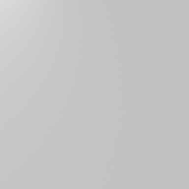

**Observations:** First import of SAM3D objects. Camera angle too high — objects barely visible on the far edge of the table.

### Round 4 — SAM3D Objects on Table

**First Frame:**
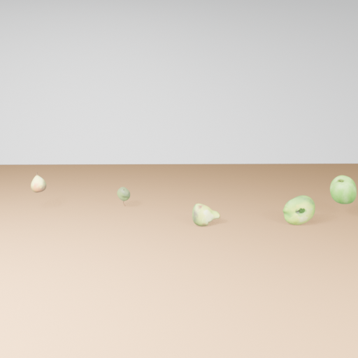

**360° Rotation:**
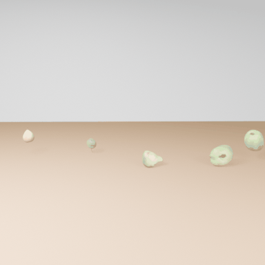

**Observations:** SAM3D fruits visible on the table — green apples and pears spread across the surface. Camera repositioned.

### Round 5 — Mixed SAM3D + Meshy

**First Frame:**
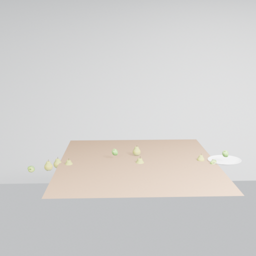

**360° Rotation:**


**Observations:** Meshy plate (white, right side) appears alongside SAM3D fruits. Jug and pear Meshy replacements fetched from cache.

### Round 15 — Best Static Composition

**First Frame:**
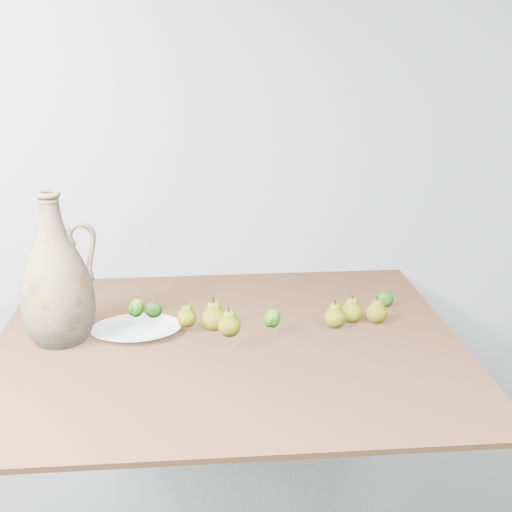

**360° Rotation:**
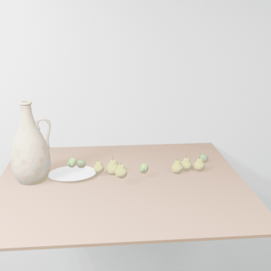

**Observations:** **Best still life composition.** Meshy jug (left), plate with SAM3D apples, SAM3D pears spread across the table. Warm table surface, clean background. Good match to Cezanne layout.

### Round 16 — Ball Added

**First Frame (Before Impact):**
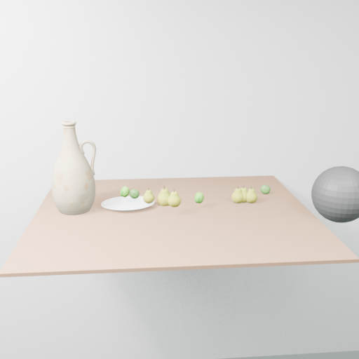

**360° Rotation:**
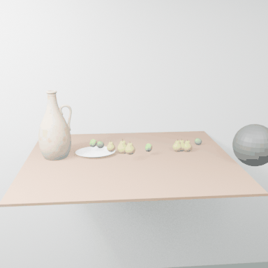

**Observations:** Gray ball (sphere) added to the right side of the scene, positioned above/near the table edge. All still life objects still intact.

### Round 17 — Ball Impact

**First Frame (Before Impact):**
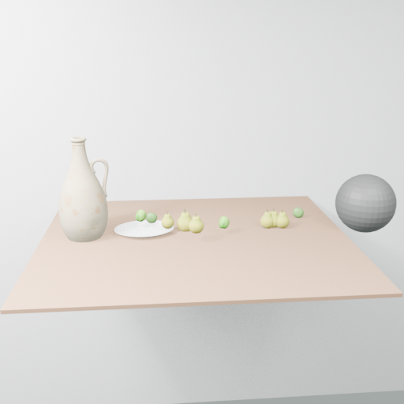

**360° Rotation:**
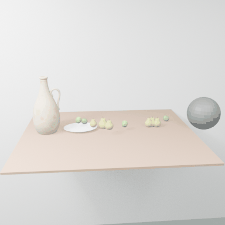

**Animation Keyframes:**

| Frame 1 | Frame 90 | Frame 180 |
|---------|----------|-----------|
|  | 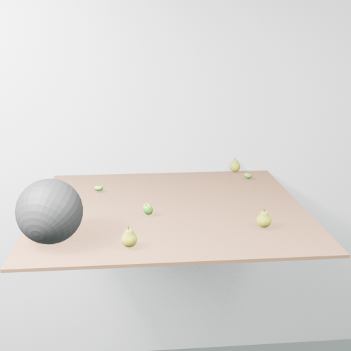 | 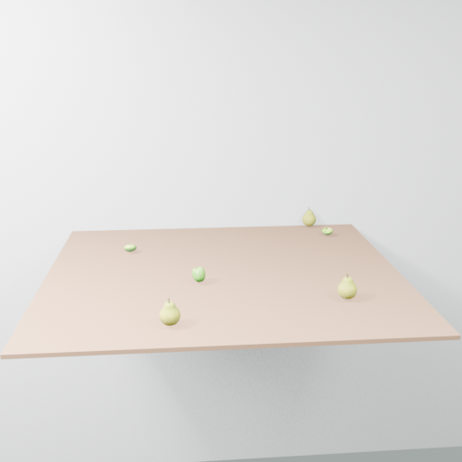 |

**Observations:** Ball impacts the scene. By frame 180, the jug and plate are knocked off the table — only 4 SAM3D pears remain on the surface. Physics successfully smashes most objects.

### Round 20 — Full Destruction

**First Frame:**


**360° Rotation:**


**Animation Keyframes:**

| Frame 1 | Frame 90 | Frame 180 |
|---------|----------|-----------|
| 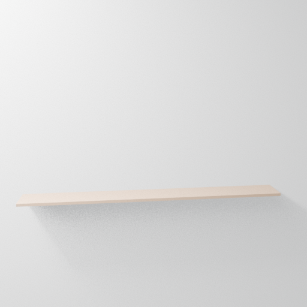 |  |  |

**Observations:** Physics too aggressive — table is completely empty from frame 1. All objects have been thrown off before the animation begins (baked physics left them on the ground).

---

## 7. Generator Round Summary

**Phase 0 — Init (Rounds 0-1):**
- Round 0: `initialize_plan` — Generator receives task + SAM3D GLB paths with transforms
- Round 1: First Blender script attempt

**Phase 1 — SAM3D + Meshy Composition (Rounds 2-6):**
- Round 2: `execute_and_evaluate` — Import all 8 SAM3D GLBs, first render
- Rounds 3-4: Scene layout adjustments
- Round 5: `get_better_object` × 3 — plate, pear, jug from **Meshy cache** (instant)
- Round 6: Composition with mixed assets

**Phase 2 — Scene Refinement (Rounds 7-15):**
- Rounds 7-11: `execute_and_evaluate` — Layout, lighting, camera adjustments
- Rounds 12-13: Verifier feedback — best static composition achieved
- Rounds 14-15: Final scene polish

**Phase 3 — Dynamic Animation (Rounds 16-21):**
- Round 16: Ball added to scene
- Round 17: Ball physics simulation — knocks most objects off table
- Rounds 18-20: Physics iterations — increased ball force
- Round 21: Final script (no render output)

---

## 8. Renders Produced

| Round | Frames | Notes |
|-------|--------|-------|
| 1 | state.blend only | Initial setup |
| 2 | f0001, f0125, f0250 | First SAM3D import (camera too high) |
| 3 | state.blend only | Script iteration |
| 4 | f0001, f0125, f0250 | SAM3D objects visible on table |
| 5 | f0001, f0125, f0250 | Mixed SAM3D + Meshy composition |
| 6 | f0001, f0125, f0250 | Layout refinement |
| 7 | state.blend only | Script iteration |
| 8-11 | state.blend only | Scene refinement (no renders) |
| 12 | f0001, f0090, f0180 | Composition refinement |
| 13 | f0001, f0090, f0180 | **Best static composition** |
| 14 | f0001, f0090, f0180 | Scene polish |
| 15 | f0001, f0090, f0180 | Pre-dynamics final |
| 16 | f0001, f0090, f0180 | Ball added |
| 17 | f0001, f0090, f0180 | **Ball impact — best dynamics** |
| 18 | f0001, f0100, f0200 | Stronger physics |
| 19 | state.blend only | Script iteration |
| 20 | f0001, f0090, f0180 | Table cleared (too aggressive) |

---

## 9. Key Observations

1. **SAM3D injection fix validated** — all 8 GLB paths + transforms correctly loaded into Generator memory via `--sam3d-results`
2. **Generator KEPT 5 SAM3D objects** — the apples and pears were used as-is; only jug, plate, and one pear were replaced with Meshy
3. **Meshy cache hits** — all 3 replacement assets loaded from cache (no API calls), saving ~2 hours
4. **~50% faster than Run 1** — 99 minutes vs 203 minutes (no SAM3D reconstruction + no Meshy API wait)
5. **Dynamic animation worked better** — ball successfully knocked most objects off the table in round 17 (vs only 1 pear in Run 1)
6. **Physics overshot in later rounds** — by round 20, the table was completely empty (all objects on ground from frame 1)
7. **Transform data not used for placement** — the Generator received translation/rotation/scale but chose its own layout instead of using the SAM3D pose data. This is expected since the prompt says to evaluate and arrange objects, not blindly apply transforms.
8. **Round 17 is the best dynamic result** — shows clear before/after: full still life → ball scatters jug, plate, and some fruits off the table

---

## 10. Comparison: Run 1 vs Run 2

| Aspect | Run 1 (20260210) | Run 2 (20260211) |
|--------|-------------------|-------------------|
| SAM3D injection | FAILED (bug) | WORKING (fixed) |
| SAM3D objects used | 0 of 8 | 5 of 8 (kept fruits) |
| Meshy assets | 4 NEW via API (~2h) | 3 from cache (instant) |
| Total duration | ~3h 23min | ~1h 39min |
| Best static round | Round 14 | Round 15 |
| Ball physics | Subtle (1 pear fell) | Aggressive (most objects off) |
| Final table state | Most objects remain | Table cleared |

---

## 11. Final Scene vs Target

| Aspect | Target (Cezanne) | Best Render (Round 15) | Dynamic (Round 17 f180) |
|--------|-------------------|------------------------|-------------------------|
| Jug | Ceramic jug | Meshy jug (good match) | Knocked off table |
| Pears | Green/yellow pears | SAM3D pears (kept) | Most scattered |
| Apples | Green apples | SAM3D apples (kept) | Some remain on table |
| Plate | White plate | Meshy plate (good) | Knocked off |
| Table | Brown wood | Beige/tan surface | Mostly empty |
| Dynamic | Ball smashes all | — | Ball clears most objects |

---

## 12. Known Issues

1. **Physics too aggressive in later rounds** — Round 20 shows empty table from frame 1. Ball parameters need fine-tuning for visually interesting destruction.
2. **SAM3D transforms not applied** — Generator received pose data but placed objects using its own layout. A future improvement could auto-place objects using SAM3D transforms as initial positions.
3. **Several rounds with no renders** — Rounds 7-11, 19 produced only state.blend files (Blender script errors or no render command).
4. **Blender path resolution** — Rotation GIF renderer saved frames to `C:\output\...` instead of project-relative path (same known Blender CWD issue).

---

## 13. File Listing

```
output/dynamic_scene/20260211_035101/artist/
├── scripts/ (1-21.py — 21 Blender Python scripts)
├── renders/
│   ├── 1/ (state.blend only)
│   ├── 2/ (Camera_f0001/f0125/f0250 + state.blend)
│   ├── 3/ (state.blend only)
│   ├── 4-6/ (3 keyframe PNGs + state.blend each)
│   ├── 7-11/ (state.blend only)
│   ├── 12-18/ (3 keyframe PNGs + state.blend each)
│   ├── 19/ (state.blend only)
│   └── 20/ (3 keyframe PNGs + state.blend)
├── gifs/ (360° rotation GIFs + frame PNGs per round)
│   ├── round_N.gif (36-frame rotation GIF, 384×384)
│   └── round_N_frames/ (36 PNG frames)
├── investigator/ (Verifier analysis data)
├── generator_memory.json (11 MB)
├── verifier_memory.json (13 MB)
└── blender_file.blend (338 MB)

data/dynamic_scene/artist/assets/
├── jug.glb (Meshy — cached from Run 1)
├── pear.glb (Meshy — cached from Run 1)
├── plate.glb (Meshy — cached from Run 1)
└── meshy.log
```

---

*Generated by VIGA (Vision-as-Inverse-Graphics Agent) with GPT-5 Generator + Verifier*
*SAM3D injection fix validated — 5 of 8 SAM3D objects kept in final scene*
*Analysis by Claude Opus 4.6*
